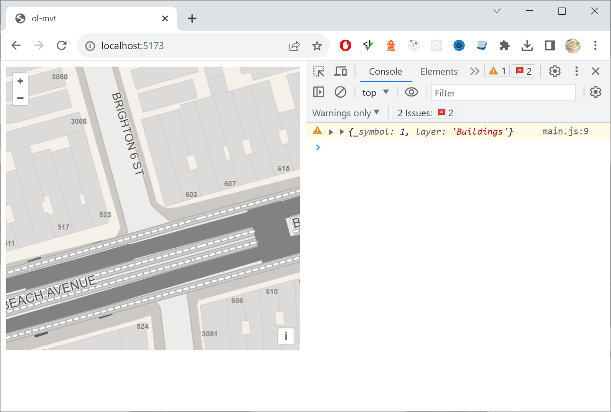

# y-no-attribute

`npm run start`

`http://localhost:5173/`

Open debug console and click on an mvt feature.  Basemap would be much more usefull if features carried some basic identifiers like BIN.

